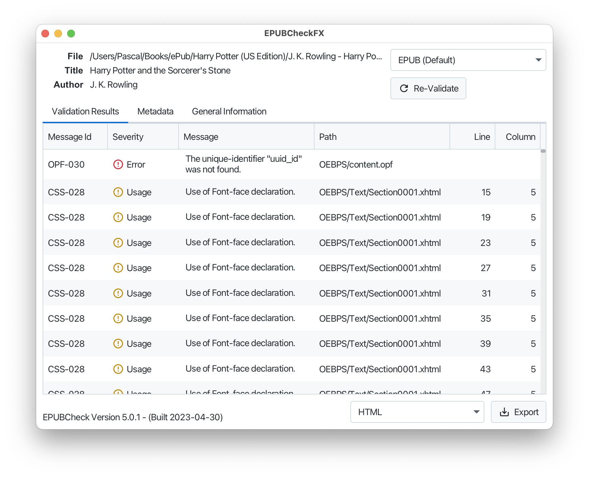

# EPUBCheckFX

An unofficial graphical interface for the official [W3C EPUBCheck](https://www.w3.org/publishing/epubcheck/) conformance checker.

## Preview



## Installation / Usage

> [!IMPORTANT]  
> An installation of [Java 17](https://adoptium.net/) or later is required to run the application.

The application EPUBCheckFX is provided as a runnable JAR. To start the application, simply
double-click on the file `EPUBCheckFX-1.0.0.jar`.

One can also start the application from the command line by executing the following command:

``` shell
java -jar EPUBCheckFX-1.0.0.jar
```

## Documentation

Please refer to the EPUBCheck documentation at https://www.w3.org/publishing/epubcheck/ or the EPUBCheck GitHub Wiki at https://github.com/w3c/epubcheck/wiki.

## Build / Development

Install the requited dependencies:

* [Java 17](https://adoptium.net/)
* [Apache Maven](https://maven.apache.org/)

In order to build the runnable JAR file and all other artifacts, you have to run the following Maven command in the terminal:

```
mvn clean package
```

## Known Issues / Bugs

- The App is only translated in English and German.
- There is no native installer or native executable available (EXE, DMG, etc.).
- It is not really possible to cancel the validation despite there being a cancel button. The button just closes the progress overlay but the validation still continues.
- It is not possible to select an EPUB folder with the button on the start page. One can however drag an EPUB folder on the window to validate it.
- The exported report is always HTML encoded even if that is not desired (e.g. when exporting to plaintext).
- All validation results are shown, even if some severity levels should be hidden by default (e.g. the severity level *Usage*).

## Credits

* EPUBCheckFX uses [EPUBCheck](https://github.com/w3c/epubcheck), the official W3C conformance checker for EPUB publications, to perform the EPUB validation.
* EPUBCheckFX is an homage to the [pagina EPUB-Checker](https://github.com/paginagmbh/EPUB-Checker) however it is a completely independent project and does not share any code.

## License

This project is open source licensed under the BSD 3-Clause License. Please see the [LICENSE file](LICENSE) for more information.
