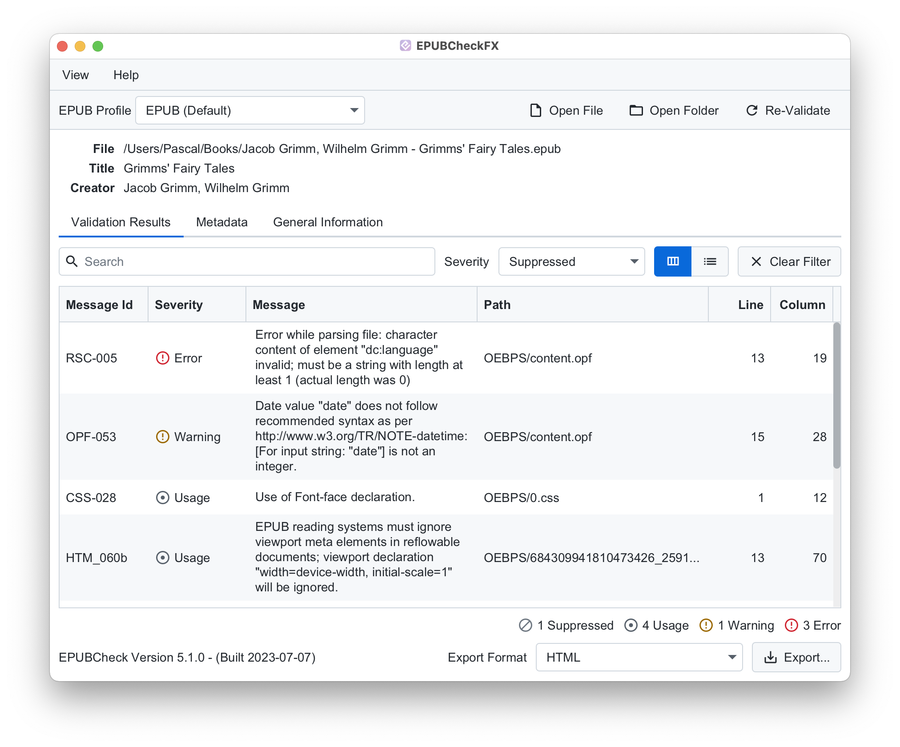
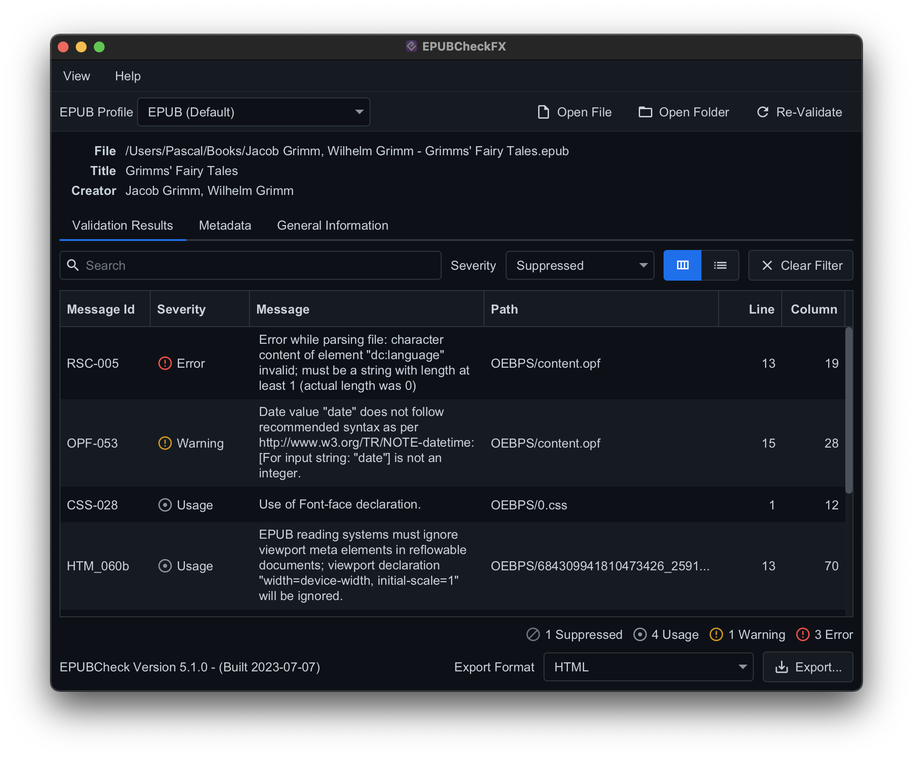

# EPUBCheckFX

A graphical interface for the official [W3C EPUBCheck](https://www.w3.org/publishing/epubcheck/) conformance checker.

## Screenshots





## Installation / Usage

> [!IMPORTANT]  
> An installation of [Java 17](https://adoptium.net/) or later is required to run the application.

Download the correct version of the application for your operating system on the [releases page](https://github.com/Wandmalfarbe/EPUBCheckFX/releases).

### Windows

1. Extract the downloaded ZIP file.
2. Double-click the extracted executable `EPUBCheckFX.exe`.

### macOS

> [!IMPORTANT]  
> ARM based Macs are currently unsupported. The macOS application or the JAR file will only run on intel based Macs.

1. Double-click the downloaded disk image (DMG file).
2. Drag the application `EPUBCheckFX` into the `Application` folder.
3. Start the application `EPUBCheckFX` from the `Application` folder by double-clicking.

### Linux

1. Extract the downloaded tar.gz archive by executing `tar -zxvf EPUBCheckFX-x.x.x-linux.tar.gz` in the terminal (where `x.x.x` is the current version number).
2. Start the application by double-clicking on the file `EPUBCheckFX-x.x.x.jar`.

    One can also start the application from the command line by executing the following command:

    ``` shell
    java -jar EPUBCheckFX-x.x.x.jar
    ```

## Documentation

Please refer to the EPUBCheck documentation at https://www.w3.org/publishing/epubcheck/ or the EPUBCheck GitHub Wiki at https://github.com/w3c/epubcheck/wiki.

## Build / Development

Install the required dependencies:

* [Java 17](https://adoptium.net/)
* [Apache Maven](https://maven.apache.org/)

In order to build the runnable JAR file and all other artifacts, you have to run the following Maven command in the terminal:

```
mvn clean package
```

## Known Issues / Bugs

- The App is only translated in English and German.
- It is not possible to select an EPUB folder with the button on the start page. One can however drag an EPUB folder on the window to validate it.

## Credits

* EPUBCheckFX uses [EPUBCheck](https://github.com/w3c/epubcheck), the official W3C conformance checker for EPUB publications, to perform the EPUB validation.
* EPUBCheckFX is an homage to the [pagina EPUB-Checker](https://github.com/paginagmbh/EPUB-Checker) however it is a completely independent project and does not share any code.

## License

This project is open source licensed under the BSD 3-Clause License. Please see the [LICENSE file](LICENSE) for more information.
